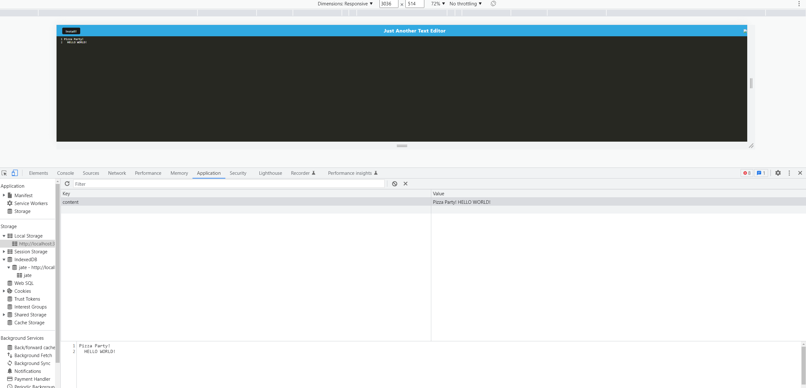

# TextEdditor

## Description
in this project we creat a text-editor that allows me to save to local storage 

## 📝 Table of Contents
- <a href="#description">Description</a>
- <a href="#installation">Installation</a>
- <a href="#usage">Usage</a>
- <a href="#contributors">Contributors</a>
- <a href="#license">License</a>
- <a href="#questions">Questions</a>
- <a href="#tests">Tests</a>

## Usage
in the clint folder npm run build
and in the server file NPM RUN START
to get this aplication to work 

A text editor is a software application designed for creating and editing plain text files, such as programming code, HTML, and other types of documents. It's useful because it offers features such as syntax highlighting, code completion, and error detection, which can help make the process of writing code faster and more efficient. Text editors also often have customizable interfaces and are highly extensible, which allows users to tailor their environment to their individual needs and preferences. Additionally, text editors often have lower system requirements than full-fledged Integrated Development Environments (IDEs), making them a lightweight option for editing text-based files.

## Contributors
Justin 

## Tests
NONE

## Questions
GITHUB: https://github.com/Activator95/

Contact Justinsemail12@yahoo.com

## License
This project is under MIT license
